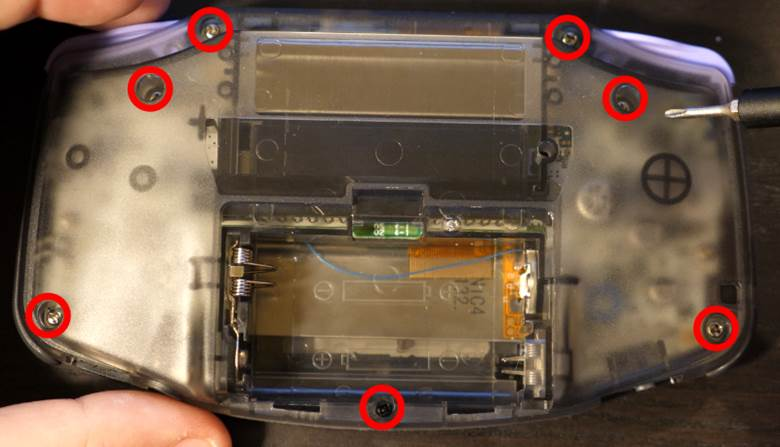
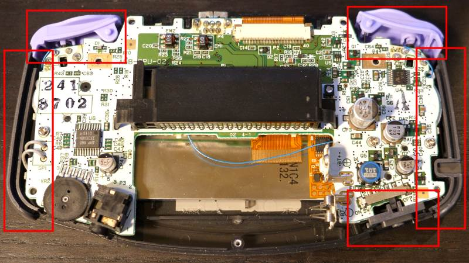
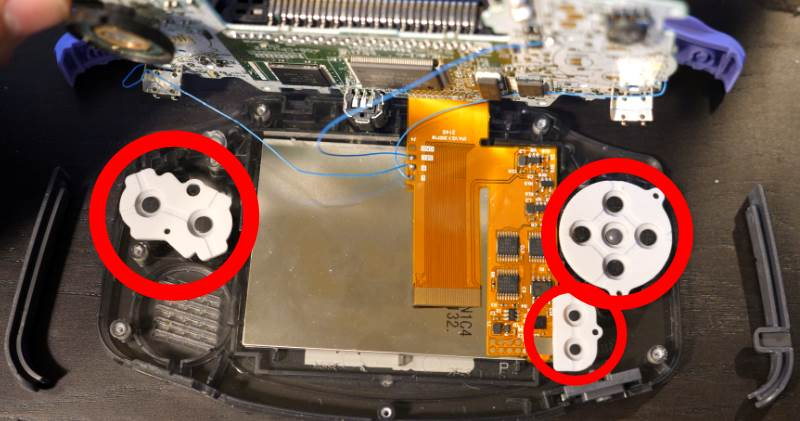
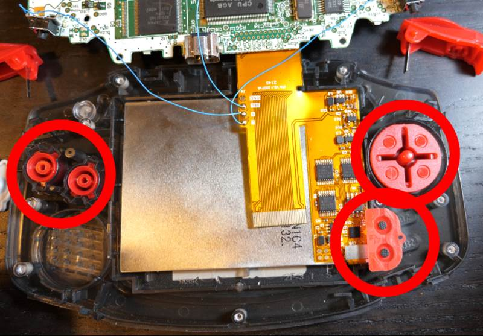
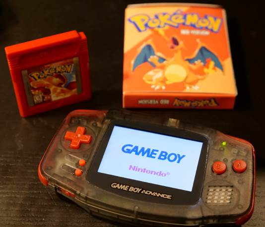

In this document, I will be going over how to replace the buttons on your Gameboy Advance. The video below shows the steps of replacing the game boy buttons in detail, I didn't bother explaining the steps of what I'm doing in the video as the video clips are detailed enough and it seemed redundant.

<iframe width="560" height="315" src="https://www.youtube.com/embed/cC5FiU5czmY" title="YouTube video player" frameborder="0" allow="accelerometer; autoplay; clipboard-write; encrypted-media; gyroscope; picture-in-picture" allowfullscreen=""></iframe>

## Preparing the Game Boy
The preparation steps may be obvious, but we will go over them for completeness. First, take out the game cartridge from the Game Boy and then remove the batteries from the Game Boy. Also, leave the battery door off.

## Remove the Game Boy back shell
There are seven screws holding the Gameboy together. There are six tri-wings screws, two at the very top, two just underneath those, and two at the very bottom of the Game Boy. The 7th Screw is in the battery area near the bottom center of the Gameboy. That screw is a Philips screw. Once you have removed all seven screws, the back of the Gameboy should lift. At this point you should be able to remove the side panels, the battery on off switch, and the L and R buttons.

## Removing the PCB
To gain access to the D-Pad, the two action buttons and the start and select buttons; you will need to unscrew the PCB and lift it. There are three screws on the PCB, one on the far-left side and two on the far-right side. All three of these screws are Phillips screws and are located relatively near the center of the Game Boy vertically. After you have removed these screws, you should not pull the PCB out; it is still connected by a ribbon cable on the top. Instead, you should flip the PCB, being careful not to damage the ribbon cable.

## Removing the face buttons
At this point, you have access to the face buttons. Start off by removing the rubber membrane from the D-Pad and the A and B buttons. Next, you can remove the rubber start and select membrane. At this point, you're free to pull out the D-Pad and the A and B plastic buttons. Congratulations, you have completed removing all the buttons from the Game Boy advance.

## Inserting the new Game Boy Advance buttons
Now you are prepared to replace all the previously removed buttons with your new buttons. You will effectively do all the actions we did to remove the buttons except in reverse. Place your new A and B buttons as well as your new deep head into the appropriate sockets ensuring that the buttons are oriented correctly. Next, replace all the membranes, including the start and select. Before placing the PCB back on, ensure that your LED light for the power is still in place. When putting the membranes back in place and sure that the holes on the membranes line up with the extruded plastic pieces. Now flip the PCB back over the membrane and ensure that the speaker goes into its socket correctly. Now you are free to place the three Phillips screws back into the PCB. Next. Put your new power switch side panels and L and R buttons in place. Now put the back cover back onto the Game Boy Advance while ensuring that the L and R buttons continue to correctly click. Finally put the black Phillips screw back into the scroll hole in the battery bay; then place all six of the tri-wing screws back into their places.

At this point you have completed replacing all the buttons on a Gameboy advance. Congratulations!