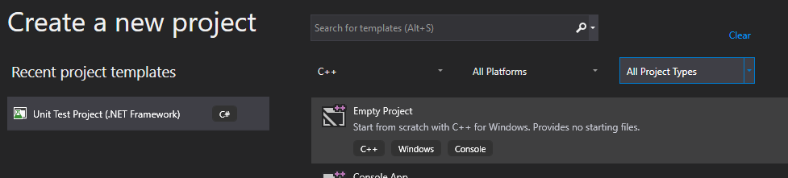

# x64 Assembly
Something that I have gotten really into recently is x64 Assembly programming. So I thought I would jot down some of the notes that I've collected from developing in the language. I am using the **MASM** assembler in a **Visual Studio** enviornment as their memory, registers, and debugging tools work well for my needs.

## Setting up a x64 only project


## Microsoft procedure calling conventions
First of all, [this document](https://docs.microsoft.com/en-us/cpp/build/x64-calling-convention?view=vs-2019) is very helpful for understanding Microsoft calling conventions.

In short, Microsoft uses ECX, EDX, R8, and R9 as the first four arguments for a procedure call and any remaining arguments should be pushed onto the stack. Below is a sample from their website:
```c++
func1(int a, int b, int c, int d, int e);
// a in RCX, b in RDX, c in R8, d in R9, e pushed on stack
```
The following is the calling convention for using floats as arguments to functions. Note, if you mix input arguments, you should still using the order described in the samples. That is to say if you have an `int` as the first argument and a `float` as the second argument, you should use `RCX, XMM1` respectively.
```c++
func2(float a, double b, float c, double d, float e);
// a in XMM0, b in XMM1, c in XMM2, d in XMM3, e pushed on stack
```

## Microsoft procedure call weirdness
Something that I haven't found in the Microsoft documentation or anywhere else is an answer to the weirdness that I had when calling procedures like `HeapAlloc` and `HeapFree`. Calling these procedures and then doing a `ret` would cause a memory access error. These procedures would make use of 32 bytes of the stack but it would be the current stack. What this would do is mess up the return address that was set onto the stack by the previous `call` instruction, in my case it changed the address to the value `03h` for some reason. Since I'm not experienced enough to understand why this is yet, the solution I found was to move the stack index before and after calling them.
```asm
sub rsp, 32					; The call to HeapAlloc uses 32 bytes on the stack
call HeapAlloc
add rsp, 32					; Return the stack pointer to original location
;...
sub rsp, 32					; The call to HeapAlloc uses 32 bytes on the stack
call HeapAlloc
add rsp, 32					; Return the stack pointer to original location
```
